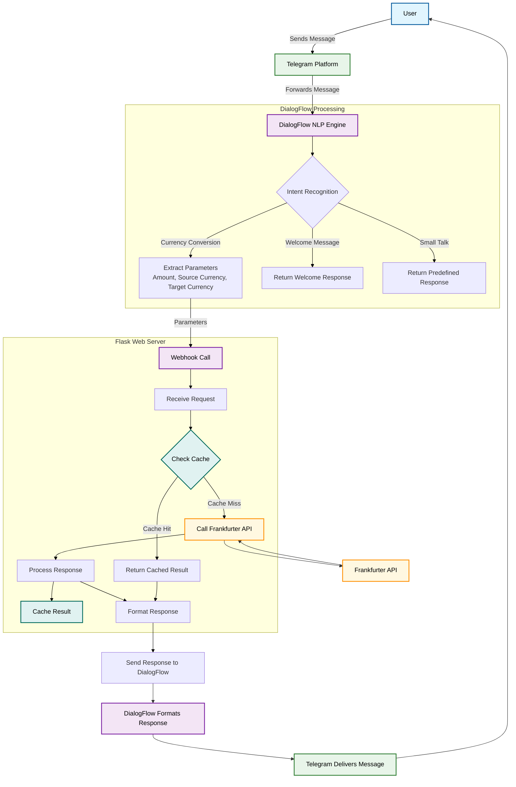

# CurrencyKaku - Telegram Currency Converter Bot

A comprehensive guide to setting up and deploying a currency conversion Telegram bot using Dialogflow and Python.

## Table of Contents
1. [Overview](#overview)
2. [Prerequisites](#prerequisites)
3. [Dialogflow Setup](#dialogflow-setup)
4. [Python Application Setup](#python-application-setup)
5. [Telegram Bot Setup](#telegram-bot-setup)
6. [Deployment](#deployment)
7. [Testing](#testing)
8. [API Reference](#api-reference)
9. [Troubleshooting](#troubleshooting)

## Overview

CurrencyKaku is a Telegram chatbot that provides real-time currency conversion using the Frankfurter API. The bot uses Dialogflow for natural language processing and a Flask-based Python application as a webhook to handle conversion logic.

## Prerequisites

Before you begin, ensure you have:
- A Google account (for Dialogflow)
- A Telegram account
- Python 3.7+ installed on your system
- ngrok (for local testing) or a cloud server (for deployment)

## Dialogflow Setup

### 1. Create a Dialogflow Agent
1. Go to [Dialogflow Console](https://dialogflow.cloud.google.com/)
2. Click "Create Agent" in the left sidebar
3. Name your agent "CurrencyConverter" or similar
4. Click "Create"

### 2. Create Intents

#### Default Welcome Intent
1. Go to Intents → Default Welcome Intent
2. Add training phrases:
   - "Hello"
   - "Hi"
   - "Start"
   - "Help"
3. Add responses:
   - "Hello! I can help you convert currencies. Try asking something like 'Convert 100 USD to EUR'"
   - "Hi there! I'm a currency converter bot. Ask me to convert between currencies!"

#### Currency Conversion Intent
1. Create a new intent named "currency.convert"
2. Add training phrases:
   - "Convert 100 dollars to euros"
   - "How much is 50 GBP in USD?"
   - "100 USD to EUR"
   - "Convert 500 yen to dollars"
   - "What's 75 euros in pounds?"
3. Set up parameters:
   - `unit-currency` (entity: @sys.unit-currency)
   - `currency-name` (entity: @sys.currency-name)
4. Enable webhook call for this intent

#### Small Talk Intent (Optional)
1. Enable Small Talk from the left sidebar
2. Configure responses for common questions like:
   - "Who are you?" → "I'm CurrencyKaku, your currency conversion assistant!"
   - "What can you do?" → "I can convert between different currencies in real-time."
   - "Thank you" → "You're welcome! Happy to help with currency conversions."

### 3. Set Up Fulfillment
1. Go to Fulfillment
2. Enable Webhook
3. Enter your webhook URL (if testing locally: https://your-ngrok-url.ngrok.io)
4. Click "Save"

## Python Application Setup

### 1. Install Dependencies
```bash
pip install flask requests
```

### 2. app.py Explanation
The provided Flask application:
- Creates a web server with two endpoints
- Handles POST requests from Dialogflow
- Extracts parameters from the user query
- Calls the Frankfurter API for conversion
- Returns the result to Dialogflow

### 3. Environment Setup
Create a virtual environment:
```bash
python -m venv venv
source venv/bin/activate  # On Windows: venv\Scripts\activate
```

## Telegram Bot Setup

### 1. Create a Telegram Bot
1. Open Telegram and search for @BotFather
2. Start a chat and send `/newbot`
3. Follow instructions to name your bot (e.g., CurrencyKaku_Dibyendu_bot)
4. Save the API token provided

### 2. Integrate with Dialogflow
1. In Dialogflow, go to Integrations
2. Select Telegram
3. Enter your Telegram bot token
4. Click "Start"


# CurrencyKaku Workflow Model

## System Architecture Overview



## Detailed Workflow Explanation

### 1. User Interaction Phase
- **User initiates** conversation by sending a message to the Telegram bot
- **Telegram platform** receives and forwards the message to DialogFlow

### 2. Natural Language Processing Phase
- **DialogFlow NLP Engine** processes the message to determine user intent
- **Intent Recognition** categorizes the request:
  - Currency Conversion: Requires parameter extraction
  - Welcome Message: Returns predefined greeting
  - Small Talk: Returns appropriate conversational response

### 3. Webhook Processing Phase
- For currency conversion requests, **parameters are extracted** (amount, source currency, target currency)
- **Webhook call** is made to the Flask application with the extracted parameters

### 4. Application Logic Phase
- **Flask application** receives the webhook request
- **Cache check** is performed to see if this conversion was recently calculated
- If cached result exists, it's returned immediately
- If no cache hit, **API call** is made to Frankfurter service
- **Response processing** extracts conversion rate and calculates result
- **Result caching** stores the conversion for future requests
- **Response formatting** creates a user-friendly message with emojis and formatting

### 5. Response Delivery Phase
- **Formatted response** is sent back to DialogFlow
- **DialogFlow** may add additional formatting or processing
- **Telegram** delivers the final response to the user
- **User** receives the currency conversion result

## System Components

### 1. User Interface Layer
- **Telegram Messenger**: Provides the chat interface
- **Rich messaging**: Supports formatted text, emojis, and interactive elements

### 2. Natural Language Processing Layer
- **DialogFlow Engine**: Handles intent recognition and parameter extraction
- **Training phrases**: Predefined examples for each intent type
- **Small talk module**: Handles conversational elements

### 3. Application Layer
- **Flask Web Server**: Handles webhook requests and responses
- **Caching mechanism**: Improves performance by storing recent conversions
- **Error handling**: Manages API failures and invalid requests

### 4. Data Layer
- **Frankfurter API**: Provides real-time currency exchange rates
- **In-memory cache**: Stores recent conversion results for quick access

## Key Features Implemented

### Performance Optimization
- **TTL Cache**: 1-hour caching of conversion results reduces API calls
- **Efficient parameter extraction**: Minimal processing before API calls
- **Error resilience**: Graceful handling of API failures

### User Experience
- **Natural language processing**: Understands various phrasings of requests
- **Rich responses**: Formatted messages with emojis for better readability
- **Quick responses**: Cached results delivered instantly for repeated queries

### Maintenance & Monitoring
- **Health endpoint**: GET route for checking application status
- **Error logging**: Comprehensive error handling and logging
- **Debug mode**: Environment-configurable debugging options

## Color Coding Legend

| Component Type | Color | Purpose |
|----------------|-------|---------|
| User Interface | Light Blue | User interaction points |
| Messaging Platform | Light Green | Telegram platform components |
| NLP Processing | Light Purple | DialogFlow natural language processing |
| Application Logic | Light Red | Flask application and business logic |
| External API | Light Yellow | Frankfurter API service |
| Caching System | Light Teal | Data caching components |

## Deployment

### Option 1: Local Testing with ngrok
1. Install ngrok from https://ngrok.com/
2. Run your Flask app: `python app.py`
3. In a new terminal, run: `ngrok http 5000`
4. Copy the forwarding URL (e.g., https://abc123.ngrok.io)
5. In Dialogflow Fulfillment, update the webhook URL
6. Test your bot on Telegram

### Option 2: Cloud Deployment (Heroku Example)
1. Create a Heroku account and install Heroku CLI
2. Create a `Procfile` with: `web: python app.py`
3. Create `requirements.txt`: 
   ```
   Flask==2.2.2
   requests==2.28.1
   ```
4. Login to Heroku: `heroku login`
5. Create app: `heroku create your-app-name`
6. Deploy: `git push heroku main`
7. In Dialogflow, set webhook to: `https://your-app-name.herokuapp.com/`

## Testing

Test your bot with various queries:
- "Convert 100 USD to EUR"
- "What is 50 GBP in JPY?"
- "100 dollars to euros"
- "75 CAD in AUD"

## API Reference

The bot uses the [Frankfurter API](https://www.frankfurter.app/docs/):
- Endpoint: `https://api.frankfurter.app/latest`
- Parameters: amount, from (source currency), to (target currency)
- Returns: JSON with conversion rates

Example API call:
```bash
GET https://api.frankfurter.app/latest?amount=100&from=USD&to=EUR
```

## Troubleshooting

### Common Issues:
1. **Webhook errors**: Check your URL is accessible and returns proper JSON
2. **Conversion fails**: Verify currency codes are valid (USD, EUR, GBP, etc.)
3. **Dialogflow doesn't recognize parameters**: Check entity mapping in intent
4. **Telegram bot not responding**: Verify bot token in Dialogflow integration

### Debugging Tips:
- Check Dialogflow's "History" section to see raw requests/responses
- Add print statements to your Flask app for debugging
- Test the Frankfurter API directly in a browser

### Sample Error Responses:
- "Sorry, I couldn't understand the currencies." → Parameter extraction failed
- "Sorry, I couldn't fetch the conversion right now." → API call failed

## Support

For additional help:
- Dialogflow documentation: https://cloud.google.com/dialogflow/docs
- Telegram Bot API: https://core.telegram.org/bots/api
- Frankfurter API documentation: https://www.frankfurter.app/docs/

## License

This project is for educational purposes. Feel free to modify and distribute.

---

**Note**: Remember to keep your API keys and tokens secure. Never commit them to version control.
