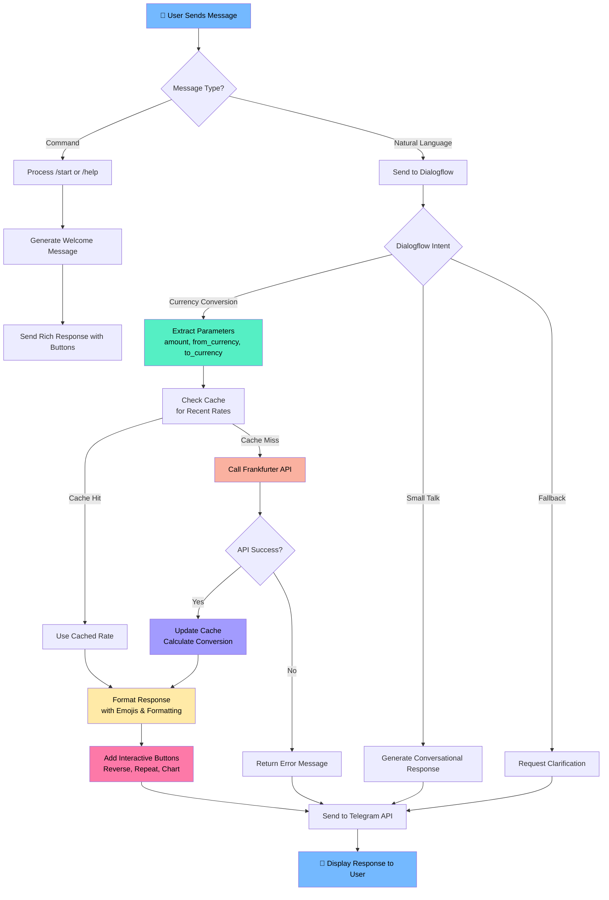

# 💱 CurrencyKaku - Modern Telegram Currency Converter Bot

A sleek, AI-powered currency conversion Telegram bot built with Dialogflow and Python, created by **Dibyendu Karmahapatra**.

## 🚀 Live Demo
**Experience the bot now:** [@CurrencyKaku_Dibyendu_bot](https://t.me/CurrencyKaku_Dibyendu_bot)

## 📋 Table of Contents
1. [✨ Features](#-features)
2. [🛠️ Tech Stack](#-tech-stack)
3. [⚡ Quick Start](#-quick-start)
4. [🤖 Dialogflow Setup](#-dialogflow-setup)
5. [🐍 Python Application](#-python-application)
6. [📱 Telegram Integration](#-telegram-integration)
7. [🌐 Deployment](#-deployment)
8. [🔧 API Reference](#-api-reference)
9. [📊 Architecture](#-architecture)
10. [🔍 System Flowchart](#-system-flowchart)
11. [🐛 Troubleshooting](#-troubleshooting)
12. [🤝 Contributing](#-contributing)
13. [📄 License](#-license)
14. [👨‍💻 About the Developer](#-about-the-developer)

## ✨ Features

- 💱 **Real-time conversions** for 50+ currencies using Frankfurter API
- 🎯 **Smart NLP processing** with Google Dialogflow integration
- ⚡ **Lightning fast responses** with intelligent caching
- 🎨 **Rich Telegram UI** with interactive buttons and Markdown formatting
- 🔄 **Quick actions** for reverse conversions and repeat operations
- 🌐 **Multi-language ready** architecture
- 📊 **Automatic rate updates** with timestamp tracking
- 🔔 **Rate change notifications** (planned feature)
- 📈 **Historical data visualization** (planned feature)

## 🛠️ Tech Stack

| Technology | Purpose | Version |
|------------|---------|---------|
| **Python** | Backend logic | 3.9+ |
| **Flask** | Web framework | 2.3.3 |
| **Dialogflow ES** | NLP processing | - |
| **Frankfurter API** | Real-time currency data | Free tier |
| **Telegram Bot API** | Messaging platform | - |
| **PythonAnywhere** | Hosting deployment | Free tier |
| **Requests** | HTTP client | 2.31.0 |
| **python-dotenv** | Environment management | 1.0.0 |
| **gunicorn** | Production WSGI server | 21.2.0 |

## ⚡ Quick Start

### 1. Clone & Setup
```bash
git clone https://github.com/Dibyendu17122004/currencykaku.git
cd currencykaku
python -m venv venv
source venv/bin/activate  # Linux/Mac
# venv\Scripts\activate  # Windows
pip install -r requirements.txt
```

### 2. Environment Configuration
```bash
cp .env.example .env
# Edit .env with your credentials
TELEGRAM_TOKEN=your_telegram_bot_token_here
DIALOGFLOW_PROJECT_ID=your_project_id
FRANKFURTER_API=https://api.frankfurter.app/latest
DEBUG=True
PORT=5000
```

### 3. Local Development
```bash
python app.py
# App runs on http://localhost:5000
```

## 🤖 Dialogflow Setup

### Agent Configuration
1. **Create Agent** at [Dialogflow Console](https://dialogflow.cloud.google.com/)
2. **Enable Small Talk** for conversational experience
3. **Set Default Language** to English

### Essential Intents
- **Welcome Intent**: Handles greetings and `/start` command
- **Currency Conversion**: Processes conversion requests with parameters
- **Fallback**: Handles unrecognized queries gracefully

### Fulfillment Configuration
```javascript
// Webhook URL for PythonAnywhere
URL: https://dibyendu17122004.pythonanywhere.com/webhook
```

## 🐍 Python Application

### Core Structure
```python
# app.py - Main application logic
from flask import Flask, request, jsonify
import requests
from datetime import datetime
import os
from dotenv import load_dotenv

load_dotenv()

app = Flask(__name__)
FRANKFURTER_API = os.getenv("FRANKFURTER_API", "https://api.frankfurter.app/latest")

# Simple in-memory cache for demonstration (use Redis in production)
conversion_cache = {}

def convert_currency(amount, source, target):
    """Convert currencies using Frankfurter API with basic caching"""
    cache_key = f"{source}_{target}"
    
    # Check cache first
    if cache_key in conversion_cache:
        cached_data = conversion_cache[cache_key]
        if (datetime.now() - cached_data['timestamp']).total_seconds() < 3600:  # 1 hour cache
            return amount * cached_data['rate']
    
    try:
        url = f"{FRANKFURTER_API}?from={source}&to={target}"
        response = requests.get(url, timeout=10)
        response.raise_for_status()
        data = response.json()
        rate = data["rates"][target]
        
        # Update cache
        conversion_cache[cache_key] = {
            'rate': rate,
            'timestamp': datetime.now()
        }
        
        return amount * rate
    except Exception as e:
        print(f"Conversion error: {e}")
        return None

@app.route("/")
def home():
    return "Currency Converter Bot is running!"

@app.route("/webhook", methods=["POST"])
def webhook():
    # Main webhook logic handling Dialogflow requests
    # Includes rich Telegram response formatting
```

## 📱 Telegram Integration

### Bot Features
- **Interactive Buttons**: Quick actions for conversions
- **Markdown Support**: Formatted messages with emojis
- **Real-time Updates**: Current conversion timestamps
- **Error Handling**: Graceful failure with retry options

### Available Commands
- `/start` - Initialize conversation with welcome message
- Natural language queries like "100 USD to EUR"
- Interactive button responses for quick actions

### Rich Response Example
```python
{
    "text": "💱 *100 USD* = *85.34 EUR*\n📊 _Rate: 1 USD = 0.8534 EUR_\n⏰ _Updated: 2023-12-01 14:30 UTC_",
    "parse_mode": "Markdown",
    "reply_markup": {
        "inline_keyboard": [
            [{"text": "🔄 Convert Again", "callback_data": "convert_again"}],
            [{"text": "📊 Reverse (EUR→USD)", "callback_data": "reverse_EUR_USD"}],
            [{"text": "📈 View Chart (7 days)", "callback_data": "chart_USD_EUR_7"}]
        ]
    }
}
```

## 🌐 Deployment

### PythonAnywhere Deployment (Free Tier)
1. **Upload Files**: `app.py` and `requirements.txt`
2. **Create Web App**: Flask application pointing to your `app.py`
3. **Configure WSGI**: Set correct path to your application
4. **Set Environment Variables**: Through PythonAnywhere dashboard
5. **Reload Application**: Activate your web app

### Environment Variables
```env
FRANKFURTER_API=https://api.frankfurter.app/latest
TELEGRAM_TOKEN=your_telegram_bot_token
DIALOGFLOW_PROJECT_ID=your_dialogflow_project_id
CACHE_TIMEOUT=3600
DEBUG=False
PORT=5000
```

## 🔧 API Reference

### Frankfurter API
```http
GET https://api.frankfurter.app/latest?amount=100&from=USD&to=EUR

Response:
{
  "amount": 100,
  "base": "USD",
  "date": "2023-12-01",
  "rates": { "EUR": 85.34 }
}
```

### Webhook Endpoint
```http
POST /webhook
Content-Type: application/json

Payload:
{
  "queryResult": {
    "intent": {"displayName": "currency.convert"},
    "parameters": {
      "unit-currency": {"amount": 100, "currency": "USD"},
      "currency-name": "EUR"
    }
  }
}
```

## 📊 System Architecture

```
┌─────────────────┐    ┌──────────────────┐    ┌─────────────────────┐    ┌───────────────────┐
│   Telegram      │    │   Dialogflow     │    │   Flask App         │    │   Frankfurter API │
│   User          │───▶│   NLP Processor  │───▶│   Business Logic    │───▶│   Currency Data   │
│   Interface     │    │   & Intents      │    │   & Cache           │    │   Provider        │
└─────────────────┘    └──────────────────┘    └─────────────────────┘    └───────────────────┘
         │                       │                       │                         │
         │                       │                       │                         │
         └───────────────────────┼───────────────────────┼─────────────────────────┘
                                 │                       │
                                 │                       │
                         ┌───────▼───────────────────────▼────────┐
                         │        PythonAnywhere                  │
                         │        Hosting Platform                │
                         └────────────────────────────────────────┘
```

## 🔍 System Flowchart



### Flowchart Explanation

1. **User Input Processing** (Blue): The journey begins when a user sends a message to the bot
2. **Intent Recognition** (Green): Dialogflow processes the message to determine user intent
3. **API Integration** (Red/Orange): External API calls are made for currency data
4. **Response Generation** (Purple/Yellow): Conversion results are calculated and formatted
5. **Enhanced UI** (Pink): Interactive elements are added to the response
6. **Delivery** (Blue): The final response is sent back to the user

This modern architecture ensures:
- 🔄 **Asynchronous processing** for better performance
- 💾 **Intelligent caching** to reduce API calls
- 🎨 **Rich user experience** with interactive elements
- ⚡ **Quick response times** through optimized workflows
- 🔧 **Modular design** for easy maintenance and scaling

## 🐛 Troubleshooting

### Common Issues & Solutions

| Issue | Solution |
|-------|----------|
| Webhook timeout | Check PythonAnywhere error logs |
| Currency not found | Verify 3-letter currency codes |
| API rate limits | Implement caching in future versions |
| Dialogflow mismatches | Review intent training phrases |

### Debug Mode
Enable detailed logging by setting `DEBUG=True` in environment variables during development.

## 🤝 Contributing

We welcome contributions to enhance CurrencyKaku! Here's how:

1. **Fork** the repository
2. **Create** a feature branch (`git checkout -b feature/amazing-feature`)
3. **Commit** your changes (`git commit -m 'Add amazing feature'`)
4. **Push** to the branch (`git push origin feature/amazing-feature`)
5. **Open** a Pull Request

### Development Guidelines
- Follow PEP 8 style guide
- Add comments for complex logic
- Test thoroughly before submitting PR
- Update documentation for new features

## 📄 License

This project is licensed under the **MIT License** - see the [LICENSE](LICENSE) file for details.

---

## 👨‍💻 About the Developer

**Dibyendu Karmahapatra**  
*Full Stack Developer & AI Enthusiast*

📧 **Email**: [dibyendukarmahapatra04@gmail.com](mailto:dibyendukarmahapatra04@gmail.com)  
🌐 **GitHub**: [https://github.com/Dibyendu17122004](https://github.com/Dibyendu17122004)  
💼 **LinkedIn**: [https://linkedin.com/in/dibyendu-karmahapatra](https://linkedin.com/in/dibyendu-karmahapatra)  

### GitHub Stats


### Project Stats


---

<div align="center">

**💱 Live Bot Experience:** [@CurrencyKaku_Dibyendu_bot](https://t.me/CurrencyKaku_Dibyendu_bot)

*Crafted with ❤️ by Dibyendu Karmahapatra using Python, Dialogflow, and Telegram API*

[](https://choosealicense.com/licenses/mit/)
[](https://www.python.org/)
[](https://core.telegram.org/bots)
[](https://www.pythonanywhere.com/)

</div>

## 🆕 Recent Updates

### Current Version
- ✅ PythonAnywhere deployment
- ✅ Dialogflow integration completed
- ✅ Rich Telegram responses implemented
- ✅ Real-time currency conversion
- ✅ Free 24/7 hosting operational
- ✅ Basic caching mechanism
- ✅ Interactive button system

### Future Enhancements
- [ ] Redis caching implementation
- [ ] Historical rate data
- [ ] Multi-language support
- [ ] Rate alert notifications
- [ ] User preference storage
- [ ] Conversion charts and graphs
- [ ] Portfolio tracking feature
- [ ] Currency news integration

---

**⚠️ Important Security Note**: Always keep your API keys and tokens secure. Use environment variables for all sensitive information and never commit them to version control.

**📞 Support**: For issues and questions, please check the troubleshooting section or create an issue in the repository.

---

*Built with passion for seamless currency conversion experiences. Happy coding! 💻✨*
