# 💱 CurrencyKaku - Modern Telegram Currency Converter Bot

A sleek, AI-powered currency conversion Telegram bot built with Dialogflow and Python.


## 🚀 Live Demo
**Experience the bot now:** [https://t.me/CurrencyKaku_Dibyendu_bot](https://t.me/CurrencyKaku_Dibyendu_bot)

## 📋 Table of Contents
1. [✨ Features](#-features)
2. [🛠️ Tech Stack](#-tech-stack)
3. [📦 Prerequisites](#-prerequisites)
4. [⚡ Quick Start](#-quick-start)
5. [🤖 Dialogflow Setup](#-dialogflow-setup)
6. [🐍 Python Application](#-python-application)
7. [📱 Telegram Integration](#-telegram-integration)
8. [🌐 Deployment](#-deployment)
9. [🔧 API Reference](#-api-reference)
10. [📊 Architecture](#-architecture)
11. [🐛 Troubleshooting](#-troubleshooting)
12. [🤝 Contributing](#-contributing)
13. [📄 License](#-license)

## ✨ Features

- 💱 **Real-time conversions** for 50+ currencies
- 🎯 **Smart NLP** with Dialogflow integration
- ⚡ **Lightning fast** responses with caching
- 📊 **Historical data** support (optional)
- 🎨 **Modern UI** with rich Telegram features
- 🔔 **Rate alerts** capability
- 🌐 **Multi-language** ready architecture
- 📈 **Analytics** and usage tracking

## 🛠️ Tech Stack

| Technology | Purpose |
|------------|---------|
| **Python 3.9+** | Backend logic |
| **Flask** | Web framework |
| **Dialogflow ES** | NLP processing |
| **Frankfurter API** | Currency data |
| **Telegram Bot API** | Messaging platform |
| **Heroku/VPS** | Deployment |
| **Redis** | Caching (optional) |

## 📦 Prerequisites

```bash
# Required software
Python 3.9+
Telegram account
Google Cloud account
ngrok (for testing)

# Install dependencies
pip install flask requests python-dotenv cachetools redis
```

## ⚡ Quick Start

### 1. Clone & Setup
```bash
git clone https://github.com/yourusername/currencykaku.git
cd currencykaku
python -m venv venv
source venv/bin/activate  # Linux/Mac
# venv\Scripts\activate  # Windows
pip install -r requirements.txt
```

### 2. Configure Environment
```bash
cp .env.example .env
# Edit .env with your credentials
TELEGRAM_TOKEN=your_telegram_bot_token_here
DIALOGFLOW_PROJECT_ID=your_project_id
FRANKFURTER_API=https://api.frankfurter.app/latest
```

### 3. Run Locally
```bash
python app.py
# In another terminal
ngrok http 5000
```

## 🤖 Dialogflow Setup

### Agent Configuration
1. **Create Agent** in [Dialogflow Console](https://dialogflow.cloud.google.com/)
2. **Enable Small Talk** for conversational AI
3. **Set Language** to English (multiple languages supported)

### Intents Structure
```yaml
- Welcome Intent:
  - Training: "hello", "hi", "start", "/start"
  - Response: Welcome message with examples

- Conversion Intent:
  - Parameters: @sys.unit-currency, @sys.currency-name
  - Training: "convert 100 usd to eur", "100 dollars in yen"
  - Webhook: Enabled

- Fallback Intent:
  - Response: Helpful error message with examples
```

### Fulfillment Setup
```javascript
// Webhook configuration
URL: https://your-app.herokuapp.com/webhook
// Enable for required intents
```

## 🐍 Python Application

### Project Structure
```
currencykaku/
├── app.py                 # Main application
├── config/               # Configuration files
│   ├── __init__.py
│   └── settings.py
├── services/             # Business logic
│   ├── currency_service.py
│   └── dialogflow_service.py
├── utils/                # Utilities
│   ├── cache.py
│   └── helpers.py
├── requirements.txt      # Dependencies
├── Procfile             # Heroku deployment
└── .env                 # Environment variables
```

### Enhanced app.py
```python
from flask import Flask, request, jsonify
from flask_caching import Cache
from services.currency_service import CurrencyConverter
from services.dialogflow_service import DialogflowProcessor
import os
from dotenv import load_dotenv

load_dotenv()

app = Flask(__name__)
app.config['CACHE_TYPE'] = 'simple'
cache = Cache(app)

converter = CurrencyConverter()
dialogflow_processor = DialogflowProcessor()

@app.route('/webhook', methods=['POST'])
@cache.cached(timeout=300)  # 5-minute cache
def webhook():
    try:
        req = request.get_json()
        intent, params = dialogflow_processor.process_request(req)
        
        if intent == 'currency.convert':
            result = converter.convert(
                params['amount'],
                params['source_currency'],
                params['target_currency']
            )
            return jsonify(dialogflow_processor.format_response(result))
        
        return jsonify(dialogflow_processor.get_response(intent))
        
    except Exception as e:
        return jsonify({'fulfillmentText': f'Sorry, an error occurred: {str(e)}'})

@app.route('/health', methods=['GET'])
def health_check():
    return jsonify({'status': 'healthy', 'service': 'currencykaku'})

if __name__ == '__main__':
    port = int(os.environ.get('PORT', 5000))
    app.run(host='0.0.0.0', port=port)
```

## 📱 Telegram Integration

### Bot Creation
1. Message [@BotFather](https://t.me/BotFather) on Telegram
2. Use `/newbot` command
3. Set name: `CurrencyKaku`
4. Set username: `CurrencyKaku_Dibyendu_bot`
5. **Enable Payments** if needed
6. **Set Commands**:
   - `/start` - Start conversation
   - `/convert` - Convert currencies
   - `/list` - Supported currencies
   - `/help` - Get help

### Rich Features
```python
# Example rich response
{
    "text": "💱 *100 USD* = *85.50 EUR*",
    "parse_mode": "Markdown",
    "reply_markup": {
        "inline_keyboard": [[
            {"text": "🔄 Convert Again", "callback_data": "convert_again"},
            {"text": "📊 History", "callback_data": "history"}
        ]]
    }
}
```

## 🌐 Deployment

### Heroku Deployment
```bash
# Create Heroku app
heroku create currencykaku-bot

# Set environment variables
heroku config:set TELEGRAM_TOKEN=your_token
heroku config:set WEBHOOK_URL=https://currencykaku-bot.herokuapp.com/webhook

# Deploy
git push heroku main

# Check logs
heroku logs --tail
```

### Environment Variables
```env
TELEGRAM_TOKEN=your_telegram_bot_token
DIALOGFLOW_PROJECT_ID=your-project-id
FRANKFURTER_API=https://api.frankfurter.app/latest
REDIS_URL=redis://localhost:6379/0  # Optional
CACHE_TIMEOUT=300
DEBUG=False
```

## 🔧 API Reference

### Frankfurter API
```http
GET https://api.frankfurter.app/latest?amount=100&from=USD&to=EUR

Response:
{
  "amount": 100,
  "base": "USD",
  "date": "2023-12-01",
  "rates": { "EUR": 85.50 }
}
```

### Webhook Endpoint
```http
POST /webhook
Content-Type: application/json

{
  "queryResult": {
    "intent": {"displayName": "currency.convert"},
    "parameters": {
      "unit-currency": {"amount": 100, "currency": "USD"},
      "currency-name": "EUR"
    }
  }
}
```

## 📊 System Architecture

```mermaid
flowchart TD
    A[📱 User Message] --> B[Telegram]
    B --> C[Dialogflow NLP]
    C --> D{Intent Recognition}
    D -->|Conversion| E[Webhook Call]
    D -->|Welcome| F[Predefined Response]
    E --> G[Flask App]
    G --> H{Redis Cache?}
    H -->|Cache Hit| I[Return Cached Result]
    H -->|Cache Miss| J[Frankfurter API]
    J --> K[Process & Cache]
    K --> L[Format Response]
    L --> M[Telegram Response]
    M --> A
    
    style A fill:#E1F5FE,color:#000
    style B fill:#E8F5E9,color:#000
    style C fill:#F3E5F5,color:#000
    style G fill:#FFEBEE,color:#000
    style J fill:#FFF8E1,color:#000
```



## 🐛 Troubleshooting

### Common Issues
| Issue | Solution |
|-------|----------|
| Webhook errors | Check URL validity and SSL |
| API timeouts | Implement retry logic |
| Currency not found | Verify currency codes |
| Dialogflow mismatches | Review training phrases |

### Debug Mode
```python
# Enable debug logging
import logging
logging.basicConfig(level=logging.DEBUG)

# Test endpoint
@app.route('/test-conversion')
def test_conversion():
    result = converter.convert(100, 'USD', 'EUR')
    return jsonify(result)
```

## 🤝 Contributing

We welcome contributions! Please see our guide:

1. Fork the repository
2. Create a feature branch (`git checkout -b feature/amazing-feature`)
3. Commit changes (`git commit -m 'Add amazing feature'`)
4. Push to branch (`git push origin feature/amazing-feature`)
5. Open a Pull Request

### Development Setup
```bash
# Install dev dependencies
pip install -r requirements-dev.txt

# Run tests
pytest tests/

# Code formatting
black app.py services/ utils/
```

## 📄 License

This project is licensed under the MIT License - see the [LICENSE](LICENSE) file for details.

---

<div align="center">

**💱 Live Bot:** [https://t.me/CurrencyKaku_Dibyendu_bot](https://t.me/CurrencyKaku_Dibyendu_bot)

*Built with ❤️ using Python, Dialogflow, and Telegram API*

[](https://choosealicense.com/licenses/mit/)
[](https://www.python.org/)
[](https://core.telegram.org/bots)

</div>

## 🆕 Changelog

### v1.2.0 (Current)
- Added Redis caching support
- Enhanced error handling
- Improved response formatting
- Added health check endpoint

### v1.1.0
- Dialogflow integration
- Multi-currency support
- Basic caching implementation

### v1.0.0
- Initial release
- Basic conversion functionality
- Telegram bot setup

---

**⚠️ Important**: Always keep your API keys and tokens secure. Never commit them to version control. Use environment variables for all sensitive information.
