# 💱 CurrencyKaku - Modern Telegram Currency Converter Bot

A sleek, AI-powered currency conversion Telegram bot built with Dialogflow and Python.


## 🚀 Live Demo
**Experience the bot now:** [https://t.me/CurrencyKaku_Dibyendu_bot](https://t.me/CurrencyKaku_Dibyendu_bot)

## 📋 Table of Contents
1. [✨ Features](#-features)
2. [🛠️ Tech Stack](#-tech-stack)
3. [📦 Prerequisites](#-prerequisites)
4. [⚡ Quick Start](#-quick-start)
5. [🤖 Dialogflow Setup](#-dialogflow-setup)
6. [🐍 Python Application](#-python-application)
7. [📱 Telegram Integration](#-telegram-integration)
8. [🌐 Deployment](#-deployment)
9. [🔧 API Reference](#-api-reference)
10. [📊 Architecture](#-architecture)
11. [🐛 Troubleshooting](#-troubleshooting)
12. [🤝 Contributing](#-contributing)
13. [📄 License](#-license)

## ✨ Features

- 💱 **Real-time conversions** for 50+ currencies
- 🎯 **Smart NLP** with Dialogflow integration
- ⚡ **Lightning fast** responses with caching
- 📊 **Historical data** support (optional)
- 🎨 **Modern UI** with rich Telegram features
- 🔔 **Rate alerts** capability
- 🌐 **Multi-language** ready architecture
- 📈 **Analytics** and usage tracking

## 🛠️ Tech Stack

| Technology | Purpose |
|------------|---------|
| **Python 3.9+** | Backend logic |
| **Flask** | Web framework |
| **Dialogflow ES** | NLP processing |
| **Frankfurter API** | Currency data |
| **Telegram Bot API** | Messaging platform |
| **Heroku/VPS** | Deployment |
| **Redis** | Caching (optional) |

## 📦 Prerequisites

```bash
# Required software
Python 3.9+
Telegram account
Google Cloud account
ngrok (for testing)

# Install dependencies
pip install flask requests python-dotenv cachetools redis
```

## ⚡ Quick Start

### 1. Clone & Setup
```bash
git clone https://github.com/yourusername/currencykaku.git
cd currencykaku
python -m venv venv
source venv/bin/activate  # Linux/Mac
# venv\Scripts\activate  # Windows
pip install -r requirements.txt
```

### 2. Configure Environment
```bash
cp .env.example .env
# Edit .env with your credentials
TELEGRAM_TOKEN=your_telegram_bot_token_here
DIALOGFLOW_PROJECT_ID=your_project_id
FRANKFURTER_API=https://api.frankfurter.app/latest
```

### 3. Run Locally
```bash
python app.py
# In another terminal
ngrok http 5000
```

## 🤖 Dialogflow Setup

### Agent Configuration
1. **Create Agent** in [Dialogflow Console](https://dialogflow.cloud.google.com/)
2. **Enable Small Talk** for conversational AI
3. **Set Language** to English (multiple languages supported)

### Intents Structure
```yaml
- Welcome Intent:
  - Training: "hello", "hi", "start", "/start"
  - Response: Welcome message with examples

- Conversion Intent:
  - Parameters: @sys.unit-currency, @sys.currency-name
  - Training: "convert 100 usd to eur", "100 dollars in yen"
  - Webhook: Enabled

- Fallback Intent:
  - Response: Helpful error message with examples
```

### Fulfillment Setup
```javascript
// Webhook configuration
URL: https://your-app.herokuapp.com/webhook
// Enable for required intents
```

## 🐍 Python Application

###  app.py
```python
from flask import Flask, request, jsonify
import requests

app = Flask(__name__)

FRANKFURTER_API = "https://api.frankfurter.app/latest"

def convert_currency(amount, source, target):
    try:
        url = f"{FRANKFURTER_API}?amount={amount}&from={source}&to={target}"
        response = requests.get(url)
        response.raise_for_status()
        data = response.json()
        return data["rates"][target]
    except Exception as e:
        print("Error during conversion:", e)
        return None

# Add this GET route
@app.route("/", methods=["GET"])
def home():
    return "Currency Converter Bot is running! Use POST requests to communicate with DialogFlow."

@app.route("/", methods=["POST"])
def webhook():
    req = request.get_json(force=True)
    
    try:
        params = req["queryResult"]["parameters"]
        source_currency = params["unit-currency"]["currency"].upper()
        amount = params["unit-currency"]["amount"]
        target_currency = params["currency-name"].upper()
    except KeyError:
        return jsonify({"fulfillmentText": "Sorry, I couldn't understand the currencies."})
    

    converted_amount = convert_currency(amount, source_currency, target_currency)
    
    if converted_amount is None:
        fulfillment_text = "Sorry, I couldn't fetch the conversion right now. Please try again later."
    else:
        fulfillment_text = f"💱 {amount} {source_currency} = {converted_amount} {target_currency}"
    

    return jsonify({"fulfillmentText": fulfillment_text})

if __name__ == "__main__":
    app.run(debug=True)
```

## 📱 Telegram Integration

### Bot Creation
1. Message [@BotFather](https://t.me/BotFather) on Telegram
2. Use `/newbot` command
3. Set name: `CurrencyKaku`
4. Set username: `CurrencyKaku_Dibyendu_bot`
5. **Enable Payments** if needed
6. **Set Commands**:
   - `/start` - Start conversation
   - `/convert` - Convert currencies
   - `/list` - Supported currencies
   - `/help` - Get help

### Rich Features

### Rich Response Features
Your app.py has been enhanced to support rich Telegram features including interactive buttons and formatted messages:

```python
# Enhanced response structure in your app.py
return jsonify({
    "fulfillmentText": f"💱 {amount} {source_currency} = {converted_amount:.2f} {target_currency}",
    "payload": {
        "telegram": {
            "text": f"💱 *Currency Conversion Result*\n\n*{amount} {source_currency}* = *{converted_amount:.2f} {target_currency}*\n\n_Last updated: {current_time}_",
            "parse_mode": "Markdown",
            "reply_markup": {
                "inline_keyboard": [
                    [
                        {"text": "🔄 Convert Again", "callback_data": "convert_again"},
                        {"text": "📊 Reverse Conversion", "callback_data": f"reverse_{target_currency}_{source_currency}"}
                    ],
                    [
                        {"text": "🌐 Other Conversions", "callback_data": "other_conversions"},
                        {"text": "💫 New Conversion", "callback_data": "new_conversion"}
                    ]
                ]
            }
        }
    }
})
```

### Interactive Features Included:

1. **Welcome Message with Quick Actions**:
   ```python
   "reply_markup": {
       "inline_keyboard": [
           [
               {"text": "💱 Convert USD to EUR", "callback_data": "quick_convert_USD_EUR"},
               {"text": "💱 Convert EUR to USD", "callback_data": "quick_convert_EUR_USD"}
           ],
           [
               {"text": "🌐 All Supported Currencies", "callback_data": "list_currencies"},
               {"text": "ℹ️ Help", "callback_data": "show_help"}
           ]
       ]
   }
   ```

2. **Conversion Result with Options**:
   ```python
   "reply_markup": {
       "inline_keyboard": [
           [
               {"text": "🔄 Convert Again", "callback_data": "convert_again"},
               {"text": "📊 Reverse Conversion", "callback_data": f"reverse_{target_currency}_{source_currency}"}
           ],
           [
               {"text": "🌐 Other Conversions", "callback_data": "other_conversions"},
               {"text": "💫 New Conversion", "callback_data": "new_conversion"}
           ]
       ]
   }
   ```

3. **Error Handling with Retry Option**:
   ```python
   "reply_markup": {
       "inline_keyboard": [
           [{"text": "🔄 Retry", "callback_data": "retry_conversion"}]
       ]
   }
   ```

### Message Formatting Features:
- **Markdown Support**: Bold, italic, and formatted text
- **Emoji Integration**: Visual indicators for different actions
- **Timestamps**: Current conversion time display
- **Structured Layout**: Clean, organized response format

### Callback Data Structure:
The bot uses callback data to handle user interactions:
- `quick_convert_[FROM]_[TO]`: Quick conversion shortcuts
- `reverse_[FROM]_[TO]`: Reverse the current conversion
- `convert_again`: Repeat the same conversion
- `other_conversions`: Show additional conversion options
- `list_currencies`: Display supported currencies
- `show_help`: Display help information

These rich features make your CurrencyKaku bot more engaging and user-friendly while maintaining the core functionality of your original app.py code.
```

## 🌐 Deployment

### Heroku Deployment
```bash
# Create Heroku app
heroku create currencykaku-bot

# Set environment variables
heroku config:set TELEGRAM_TOKEN=your_token
heroku config:set WEBHOOK_URL=https://currencykaku-bot.herokuapp.com/webhook

# Deploy
git push heroku main

# Check logs
heroku logs --tail
```

### Environment Variables
```env
TELEGRAM_TOKEN=your_telegram_bot_token
DIALOGFLOW_PROJECT_ID=your-project-id
FRANKFURTER_API=https://api.frankfurter.app/latest
REDIS_URL=redis://localhost:6379/0  # Optional
CACHE_TIMEOUT=300
DEBUG=False
```

## 🔧 API Reference

### Frankfurter API
```http
GET https://api.frankfurter.app/latest?amount=100&from=USD&to=EUR

Response:
{
  "amount": 100,
  "base": "USD",
  "date": "2023-12-01",
  "rates": { "EUR": 85.50 }
}
```

### Webhook Endpoint
```http
POST /webhook
Content-Type: application/json

{
  "queryResult": {
    "intent": {"displayName": "currency.convert"},
    "parameters": {
      "unit-currency": {"amount": 100, "currency": "USD"},
      "currency-name": "EUR"
    }
  }
}
```

## 📊 System Architecture

```mermaid
flowchart TD
    A[📱 User Message] --> B[Telegram]
    B --> C[Dialogflow NLP]
    C --> D{Intent Recognition}
    D -->|Conversion| E[Webhook Call]
    D -->|Welcome| F[Predefined Response]
    E --> G[Flask App]
    G --> H{Redis Cache?}
    H -->|Cache Hit| I[Return Cached Result]
    H -->|Cache Miss| J[Frankfurter API]
    J --> K[Process & Cache]
    K --> L[Format Response]
    L --> M[Telegram Response]
    M --> A
    
    style A fill:#E1F5FE,color:#000
    style B fill:#E8F5E9,color:#000
    style C fill:#F3E5F5,color:#000
    style G fill:#FFEBEE,color:#000
    style J fill:#FFF8E1,color:#000
```



## 🐛 Troubleshooting

### Common Issues
| Issue | Solution |
|-------|----------|
| Webhook errors | Check URL validity and SSL |
| API timeouts | Implement retry logic |
| Currency not found | Verify currency codes |
| Dialogflow mismatches | Review training phrases |

### Debug Mode
```python
# Enable debug logging
import logging
logging.basicConfig(level=logging.DEBUG)

# Test endpoint
@app.route('/test-conversion')
def test_conversion():
    result = converter.convert(100, 'USD', 'EUR')
    return jsonify(result)
```

## 🤝 Contributing

We welcome contributions! Please see our guide:

1. Fork the repository
2. Create a feature branch (`git checkout -b feature/amazing-feature`)
3. Commit changes (`git commit -m 'Add amazing feature'`)
4. Push to branch (`git push origin feature/amazing-feature`)
5. Open a Pull Request

### Development Setup
```bash
# Install dev dependencies
pip install -r requirements-dev.txt

# Run tests
pytest tests/

# Code formatting
black app.py services/ utils/
```

## 📄 License

This project is licensed under the MIT License - see the [LICENSE](LICENSE) file for details.

---

<div align="center">

**💱 Live Bot:** [https://t.me/CurrencyKaku_Dibyendu_bot](https://t.me/CurrencyKaku_Dibyendu_bot)

*Built with ❤️ using Python, Dialogflow, and Telegram API*

[](https://choosealicense.com/licenses/mit/)
[](https://www.python.org/)
[](https://core.telegram.org/bots)

</div>

## 🆕 Changelog

### v1.2.0 (Current)
- Added Redis caching support
- Enhanced error handling
- Improved response formatting
- Added health check endpoint

### v1.1.0
- Dialogflow integration
- Multi-currency support
- Basic caching implementation

### v1.0.0
- Initial release
- Basic conversion functionality
- Telegram bot setup

---

**⚠️ Important**: Always keep your API keys and tokens secure. Never commit them to version control. Use environment variables for all sensitive information.
